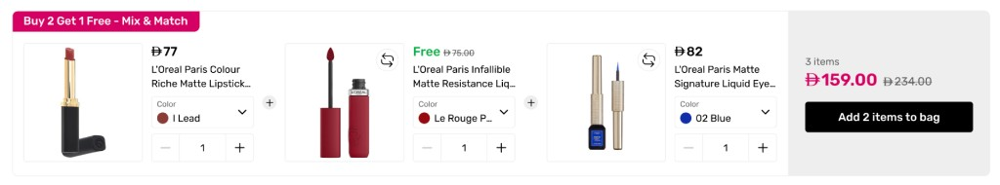

# Al-Futtaim

## Shop Information

| Field | Value |
| --- | --- |
| Shop | Al-Futtaim |
| Brand | Faces / Al-Futtaim |
| Shop Status | — |
| Migration | — |
| Total Bundles | 2 |
| Bundle Status | — |
| HubSpot | — |
| Unmet feature | swap alternatives inside a fixed bundle; B2G1F mix & match |

## Customer Background

Faces-style storefront widgets: a fixed bundle with per-slot swap, and a Buy 2 Get 1 Free mix-and-match row with color and quantity controls.

## Existing Bundle Setup

1. **Fix swap bundle** → [`fix-swap-bundle/`](./fix-swap-bundle/)
2. **Buy 2 Get 1 Free — Mix & Match** → [`buy2get1free-mixandmatch/`](./buy2get1free-mixandmatch/)

### Fix swap bundle

Configure each bundle slot as a **Single Product** selector. For a swappable slot, add the alternative products as extra Single Product selectors and attach one quantity condition: **exactly 1** (or **at most 1**) across that slot’s selectors together. Fixed slots get their own **exactly 1** condition.

A **Shopify Collection** selector also works as one swappable slot (pick one product from the collection).

### Buy 2 Get 1 Free — Mix & Match

Use three **Single Product** selectors (the default mix) with **at least 3** items across them, and a **100% off 1** reward on the cheapest item. Optional swap groups use **exactly 1** across a slot’s alternatives. A single **Shopify Collection** selector also works: selected products render as the connected cards.

## Renderer Functions

### [`fix-swap-bundle/renderer-function.js`](./fix-swap-bundle/renderer-function.js)

Horizontal fixed-bundle widget (`nb-widget--swap`). Renders one card per slot (image, price, title, optional variant `<select>`). Slots with two or more alternatives show a swap icon. Clicking swap opens a **Replace with** drawer under the row (CSS-only; no renderer listeners). Choosing an alternative applies an atomic `selectionPlanChange` and the drawer closes on re-render. Footer shows item count, live total, and **Add N items to bag**.

Does **not** include volume-discount tiers, addon checkboxes, gift strips, or theme ATC hide/reposition logic.

**Cart / theme integration:** Knit ATC (`data-nameless-atc`), omitted when `meta.atcOverride` is true. No cart drawer bridge.

### [`buy2get1free-mixandmatch/renderer-function.js`](./buy2get1free-mixandmatch/renderer-function.js)

Horizontal mix-and-match widget (`nb-widget--b2g1`). Pink **Buy 2 Get 1 Free - Mix & Match** badge, product cards joined by `+`, color dropdown with swatch, qty stepper, and a gray summary rail (item count, magenta total, compare-at, **Add N items to bag** using the paid count). A fully discounted line shows green **Free**. Swap icon opens a Replace with drawer when the slot has alternatives.

Does **not** include volume-discount tier lists, addon checkbox lists, or theme ATC hide/reposition logic.

**Cart / theme integration:** Knit ATC (`data-nameless-atc`), omitted when `meta.atcOverride` is true. No cart drawer bridge.

## Technical Assets

- [`select-alternatives.png`](./select-alternatives.png) — expected swap-flow design
- [`buy2get1free-mixandmatch.png`](./buy2get1free-mixandmatch.png) — expected B2G1F mix-and-match design
- [`fix-swap-bundle/`](./fix-swap-bundle/) — `renderer-function.js`, `styling.css`
- [`buy2get1free-mixandmatch/`](./buy2get1free-mixandmatch/) — `renderer-function.js`, `styling.css`
