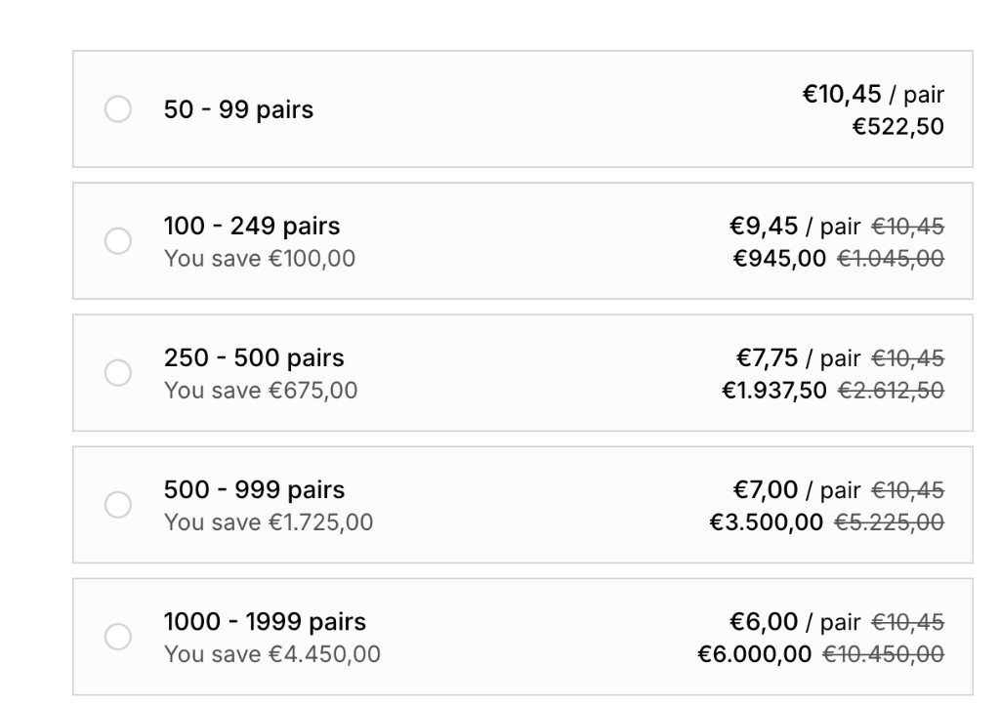

# t19wk1-1m.myshopify.com

## Shop Information

| Field | Value |
| --- | --- |
| Shop | t19wk1-1m.myshopify.com |
| Brand | Kove The Brand |
| Shop Status | Active |
| Storefront | [kovethebrand.com](https://kovethebrand.com) |
| Total Bundles | 1 |
| Bundle Status | Draft assets (paste into Knit) |

## Customer Background

Kove sells premium grip socks (Pilates / yoga / barre) and a **Studio Partners** wholesale programme. Custom grip socks start at **50 pairs**. The widget is a vertical quantity-break list: range, “You save”, unit price / pair, and line total, with EUR formatting (`€1.045,00`).

## Knit editor setup

**Product set**

- Set #1: **Single Product** → the custom / wholesale socks product, **or**
- Set #1: **Single Product (Collection-backed)** → studio collection, so the same breaks run on every product in that collection.

Price the product at the wholesale unit price (**€10,45**). Higher tiers discount from that price.

**Condition–reward cards** (all on Set #1). Use **fixed amount → per unit**:

| Card | Customer buys | Reward |
| --- | --- | --- |
| 1 | **between 50 and 99** | none (base wholesale) |
| 2 | **between 100 and 249** | **€1,00** off per unit → €9,45 |
| 3 | **between 250 and 500** | **€2,70** off per unit → €7,75 |
| 4 | **between 500 and 999** | **€3,45** off per unit → €7,00 |
| 5 | **between 1000 and 1999** | **€4,45** off per unit → €6,00 |

Cards 3 and 4 both include **500** (as in the design). At qty 500 the widget uses the later / higher tier (€7,00). To avoid overlap, set card 3 to **250–499**.

Paste [`quantity-breaks/renderer-function.js`](./quantity-breaks/renderer-function.js) and [`quantity-breaks/styling.css`](./quantity-breaks/styling.css) into the bundle Renderer and Stylings. Set the bundle **Active**.

Optional `meta`: `title`, `unitLabel` (default `pairs`), `unitPriceSuffix` (default `/ pair`), `saveLabel` (default `You save`), `variantLabel` (default `Size`), `atcLabel`, `atcOverride`, `previewPrice` (default `10.45`), `tierTitles`.

## Renderer Function

### [`quantity-breaks/renderer-function.js`](./quantity-breaks/renderer-function.js)

Volume quantity-break widget (`qb-widget`). One **Size** `<select>` at the top (`data-nameless-variant-selector`) — the whole order is that one variant. Each radio row is a Knit quantity range with its own **quantity stepper** (min–max). Unselected rows show that tier’s last/min qty; using another row’s stepper selects that tier. EUR amounts use `€x.xxx,xx`. Auto-selects the first tier. Knit ATC (skipped via `meta.atcOverride`).

**Cart / theme integration:** Moves the Knit block before `product-form .product-form__buttons` / cart-add form and hides the theme ATC (and Shopify payment button when the wrapper is missing) unless `meta.atcOverride`. No cart-drawer bridge.

## Technical Assets

- [`quantity-breaks/`](./quantity-breaks/) — `renderer-function.js`, `styling.css`
- [`quantity-breaks.png`](./quantity-breaks.png) — expected storefront design
